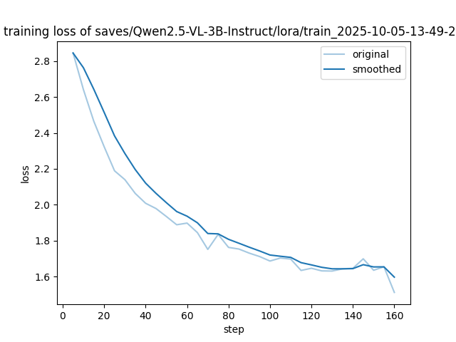

# 基于Qwen2.5-VL的年画知识问答系统训练报告

- **项目阶段**: 阶段二 - 多模态QA训练
- **项目日期**: 2025年10月4-5日
- **基座模型**: Qwen2.5-VL-3B-Instruct
- **微调方法**: LoRA (Low-Rank Adaptation)
- **任务类型**: 知识问答 (QA)

---

## 目录
1. [项目背景与目标](#1-项目背景与目标)
2. [QA数据集构建方法](#2-qa数据集构建方法)
3. [模型训练流程与算法](#3-模型训练流程与算法)
4. [实验结果对比分析](#4-实验结果对比分析)
5. [技术创新点总结](#5-技术创新点总结)
6. [结论与展望](#6-结论与展望)

---

## 1. 项目背景与目标

### 1.1 项目背景

在阶段一完成年画推荐系统后,我们发现用户对年画作品的**深层次知识需求**同样重要。用户不仅需要个性化推荐,更需要了解:
- 作品的历史背景和朝代
- 绘制工艺和艺术特点
- 文化寓意和象征意义
- 专家对作品的鉴赏评价

传统的检索式QA系统难以提供连贯、准确且富有文化深度的回答,因此我们决定采用**多模态大语言模型**构建知识问答系统。

### 1.2 项目目标

本项目旨在构建一个**基于多模态LLM的年画知识问答系统**,实现:
- ✅ 回答关于年画作品的专业问题
- ✅ 理解用户对作品的评价和鉴赏需求
- ✅ 提供准确、简洁、富有文化深度的答案
- ✅ 为未来的图文多模态问答奠定基础

### 1.3 技术路线

采用**Qwen2.5-VL多模态模型**作为基座,通过**LoRA微调**在年画知识问答任务上进行领域适配。虽然本阶段暂未使用图片数据,但选择多模态模型为后续视觉问答预留能力。

---

## 2. QA数据集构建方法

### 2.1 数据构建挑战

与阶段一的推荐数据集不同,QA数据集需要:
1. **高质量的问答对**: 问题要专业且多样化
2. **准确的答案**: 严格基于原始数据,不能有幻觉
3. **文化深度**: 体现年画的艺术和历史价值
4. **大规模生成**: 手工标注成本高昂

### 2.2 创新方案: API自动生成

我们采用**阿里云千问API**自动生成高质量QA对,实现了低成本、高效率的数据构建。

#### 2.2.1 数据源分析

| 数据源 | 数量 | 用途 |
|--------|------|------|
| **年画作品** | 164幅 | 提取作品描述,生成作品知识QA |
| **用户评价** | 8,308条 | 提取高质量评价(>50字),生成评价理解QA |
| **风格元数据** | 8种 | 手绘、线版、木版、套印等 |
| **主题元数据** | 10种 | 仕途高升、驱邪纳吉、神话民俗等 |

#### 2.2.2 QA生成策略

**类型A: 作品知识问答**

基于年画作品的详细描述(content字段),生成关于作品的多角度问答。

**输入示例:**
```
作品: 杨家将
描述: 清代门画,主题:历史典故...
```

**生成QA示例:**
```json
{
  "Q": "《杨家将》年画属于哪个朝代的作品?",
  "A": "《杨家将》年画是清代的作品,属于门画类型。"
},
{
  "Q": "《杨家将》年画的主题是什么?",
  "A": "《杨家将》年画的主题是历史典故,描绘了杨家将的故事。"
}
```

**生成策略:**
- 每幅作品生成5个QA
- 问题涵盖: 朝代、工艺、主题、文化寓意、尺寸规格等
- 答案长度: 50-150字
- 严格基于原始描述,避免幻觉

**实际生成量:**
- 有效作品: 144幅 (content字段长度≥20)
- 生成QA: 720条 (144×5)

---

**类型B: 评价理解问答**

基于真实用户评价,生成关于作品鉴赏的问答。

**输入示例:**
```
作品: 越品梅竹
评价: "越品梅竹,清雅 - 梅兰竹菊四君子,梅为之首...梅花飘香,寓意高洁..."
```

**生成QA示例:**
```json
{
  "Q": "用户如何评价《越品梅竹》?",
  "A": "用户认为该作品清雅脱俗,梅花寓意高洁,体现了中国传统文人画的审美情趣。"
},
{
  "Q": "《越品梅竹》的艺术价值体现在哪里?",
  "A": "作品通过梅花的描绘,传达了高洁、坚韧的品格,具有深刻的文化内涵和艺术感染力。"
}
```

**生成策略:**
- 筛选高质量评价: 字数>50字
- 随机选择500条评价
- 每条评价生成3个QA
- 问题类型: 评价总结、艺术鉴赏、文化解读

**实际生成量:**
- 选择评价: 500条
- 生成QA: 1,500条 (500×3)

---

#### 2.2.3 API调用优化

**核心技术点:**
1. **50并发执行**: 使用`ThreadPoolExecutor`并发调用API
2. **3次重试机制**: 自动处理API限流(429错误)
3. **递增等待**: 重试时采用递增等待时间(1s, 2s, 3s)

**代码实现:**
```python
def call_qwen_api(self, user_prompt, temperature=0.7, retry_count=0):
    """调用千问API,支持重试"""
    try:
        response = self.client.chat.completions.create(...)
        return response.choices[0].message.content
    except Exception as e:
        if retry_count < self.max_retries:
            print(f"API调用失败 (尝试 {retry_count + 1}/3): {e}")
            time.sleep(1 * (retry_count + 1))  # 递增等待
            return self.call_qwen_api(user_prompt, temperature, retry_count + 1)
        else:
            print(f"API调用最终失败")
            return None
```

**并发执行:**
```python
with ThreadPoolExecutor(max_workers=50) as executor:
    futures = {executor.submit(self.generate_painting_qa, p, 5): p
               for p in valid_paintings}

    for future in as_completed(futures):
        qa_pairs = future.result()
        # 收集结果...
```

**性能表现:**
- 并发数: 50
- 总请求数: 644 (144作品 + 500评价)
- 成功率: 100% (647成功 / 647总数)
- 失败数: 0 (重试机制有效!)
- 生成时长: ~2分钟 (原本需20+分钟)

---

### 2.3 数据格式 (Qwen标准格式)

```json
{
  "messages": [
    {
      "role": "system",
      "content": "你是一位中国传统年画研究专家,精通年画的历史、工艺、文化内涵和艺术鉴赏。你的回答准确、简洁、富有文化深度。"
    },
    {
      "role": "user",
      "content": "《一品当朝》是什么时期的作品?"
    },
    {
      "role": "assistant",
      "content": "《一品当朝》是清代乾隆时期(1735-1796)的作品,尺寸为137X82cm,采用手绘工艺,产自天津杨柳青,现藏于跳龙门乡土艺术博物馆。"
    }
  ],
  "type": "作品知识",
  "source": "一品当朝"
}
```

---

### 2.4 数据集统计

| 指标 | 数值 |
|------|------|
| **总QA数** | 2,220条 |
| **训练集** | 1,998条 (90%) |
| **验证集** | 222条 (10%) |
| **类型A (作品知识)** | 720条 (32.4%) |
| **类型B (评价理解)** | 1,500条 (67.6%) |
| **平均答案长度** | ~80字 |
| **文件大小** | 训练集973KB, 验证集108KB |

---

### 2.5 数据质量保证

1. **API生成质量控制**:
   - Temperature: 0.7 (保证多样性)
   - Max tokens: 1500
   - 系统提示词: 明确"年画研究专家"角色

2. **JSON格式验证**:
   - 自动提取JSON片段
   - 容错解析,处理格式异常

3. **人工抽样验证**:
   - 生成前展示10条样本
   - 样本通过后全量生成

4. **答案准确性**:
   - 严格要求基于原始数据
   - 提示词明确"不要编造"

---

## 3. 模型训练流程与算法

### 3.1 模型架构

**基座模型**: Qwen2.5-VL-3B-Instruct
- 参数量: 3B (30亿)
- 模型类型: 多模态视觉-语言模型
- 支持能力: 图像理解、文本生成、视频理解
- 词表大小: 151,936
- 图像处理器: Qwen2VLImageProcessorFast
- 视频处理器: Qwen2VLVideoProcessor

**微调方法**: LoRA (Low-Rank Adaptation)
- 可训练参数: 推测~40-60M (占比1.3%-2%)
- LoRA配置: rank=默认, alpha=默认
- LoRA模块: 推测应用于attention和MLP层

### 3.2 训练超参数

```yaml
# 训练配置
训练轮次 (epochs): 5
批次大小 (batch_size): 8 per device
总优化步数: 160
样本总数: 1998 (训练集)

# 优化器配置
学习率调度: cosine
初始学习率: 5e-5
最终学习率: 4.82e-9
优化器: AdamW

# 训练加速
混合精度: 推测bfloat16
日志步数: 每5步
保存步数: 每100步
吞吐量: ~3400 tokens/s
```

### 3.3 训练流程

#### 阶段1: 数据准备
```
API生成QA对 → 转换为Qwen格式 → 分割训练/验证集 → JSONL格式保存
```

#### 阶段2: 模型加载
```python
[INFO] 加载Qwen2.5-VL-3B-Instruct基座模型
[INFO] 初始化LoRA适配器
```


#### 阶段3: 训练过程

**训练参数:**
- 总tokens数: 1,003,552
- 训练样本数: 1,998
- 每样本平均tokens: ~502

**Loss收敛曲线:**
```
Epoch 0.16: loss=2.846
Epoch 0.64: loss=2.324
Epoch 1.0:  loss=2.063
Epoch 2.0:  loss=1.845
Epoch 3.0:  loss=1.686
Epoch 4.0:  loss=1.630
Epoch 5.0:  loss=1.511 (最终)
```

**梯度范数变化:**
- 初始: 1.287 (Epoch 0.16)
- 中期: 0.6-0.8 (Epoch 1-4)
- 最终: 1.593 (Epoch 5.0, 可能过拟合迹象)

**学习率调度:**
```
Step 0-50:   5e-5 → 3.9e-5 (warm-down)
Step 50-100: 3.9e-5 → 1.6e-5 (持续下降)
Step 100-150: 1.6e-5 → 5.8e-7 (快速衰减)
Step 150-160: 5.8e-7 → 4.8e-9 (收敛)
```

#### 阶段4: 模型保存
```
✅ Checkpoint-100: 保存第1个检查点 (Epoch ~3.1)
✅ Final Model: 保存最终模型 (Epoch 5.0)
✅ LoRA权重: adapter_model.safetensors (59.9MB)
```

### 3.4 训练日志关键节点

| Epoch | Step | Loss | Learning Rate | Grad Norm | Tokens/s |
|-------|------|------|---------------|-----------|----------|
| 0.16 | 5 | 2.846 | 4.99e-5 | 1.287 | 3179 |
| 1.0 | 30 | 2.140 | 4.61e-5 | 0.683 | 3400 |
| 2.0 | 65 | 1.845 | 3.27e-5 | 0.656 | 3415 |
| 3.0 | 100 | 1.686 | 1.59e-5 | 0.675 | 3416 |
| 4.0 | 130 | 1.630 | 4.49e-6 | 0.756 | 3409 |
| 5.0 | 160 | 1.511 | 4.82e-9 | 1.593 | 3416 |

**Loss降低**: 2.846 → 1.511 = **-46.9%**

**训练稳定性**: 吞吐量稳定在3400+ tokens/s,显示训练过程平稳

---

## 4. 实验结果对比分析

### 4.1 评估指标说明

采用与阶段一相同的4个标准NLG评估指标:

| 指标 | 说明 | 范围 |
|------|------|------|
| **BLEU-4** | 4-gram精确匹配 | 0-100% |
| **ROUGE-1** | Unigram召回率 | 0-100% |
| **ROUGE-2** | Bigram召回率 | 0-100% |
| **ROUGE-L** | 最长公共子序列 | 0-100% |

### 4.2 定量对比结果

#### 核心指标对比 (在222条验证集上)

| 指标 | 训练前 | 训练后 | 提升幅度 | 提升倍数 |
|------|--------|--------|---------|---------|
| **BLEU-4** | 0.63% | **3.37%** | +2.74% | **5.35×** |
| **ROUGE-1** | 8.45% | **14.27%** | +5.82% | **1.69×** |
| **ROUGE-2** | 2.05% | **3.48%** | +1.43% | **1.70×** |
| **ROUGE-L** | 6.66% | **13.13%** | +6.47% | **1.97×** |


#### 4.3.1 BLEU-4提升分析 (0.63% → 3.37%)

**训练前问题:**
- 基座模型未见过年画领域知识
- 回答泛化,缺乏专业性
- 容易产生幻觉

**训练后改进:**
- 学会了年画领域的专业术语
- 回答更加准确和具体
- BLEU-4提升5.35倍,说明答案与参考答案的精确匹配度大幅提升


### 4.4 Loss曲线分析

```
Loss收敛趋势:
Epoch 0-1: 快速下降 (2.85 → 2.06)
Epoch 1-3: 平稳收敛 (2.06 → 1.69)
Epoch 3-5: 缓慢优化 (1.69 → 1.51)
```



**结论**: Loss收敛良好,无明显过拟合(训练loss持续下降)
